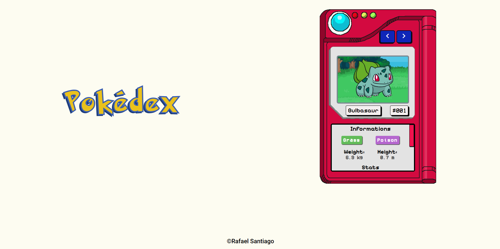

# Pokédex

Para acessar o projeto clique aqui
[https://rafaelsantiagosilva.github.io/Pokedex/](https://rafaelsantiagosilva.github.io/Pokedex/ "Link para o projeto")

## Sobre o projeto

Uma pokédex que lista os 151 primeiros pokémon (os melhores) de forma interativa, usando a PokeAPI.

Para navegar entre os pokémon, basta clicar nos botões azuis respectivos na parte superior da pokédex.

### Tecnologias usadas

### Alguns detalhes

Ele mostra em um visor superior a imagem do pokémon com o ID atual, logo abaixo seu nome e ID e depois mais informações, como seus tipos e stats. Tudo isso sendo obtido de forma direta através da PokeAPI.

O ID do pokémon atual é gurdado no local storage do navegador, através de uma API de mesmo nome do JavaScript. Portanto, quando acessar novamente o projeto, vai continuar no mesmo pokémon de quando havia saido.

#### Fontes

- PokeAPI: [pokeapi.co](https://pokeapi.co/)
- Imagens de fundo: [kWharever](https://www.deviantart.com/kwharever/art/Battle-Backgrounds-v-2-FREE-TO-USE-768031287)
- Som dos botões: [floraphonic](https://pixabay.com/pt/users/floraphonic-38928062/?utm_source=link-attribution&utm_medium=referral&utm_campaign=music&utm_content=186976>floraphonic)
